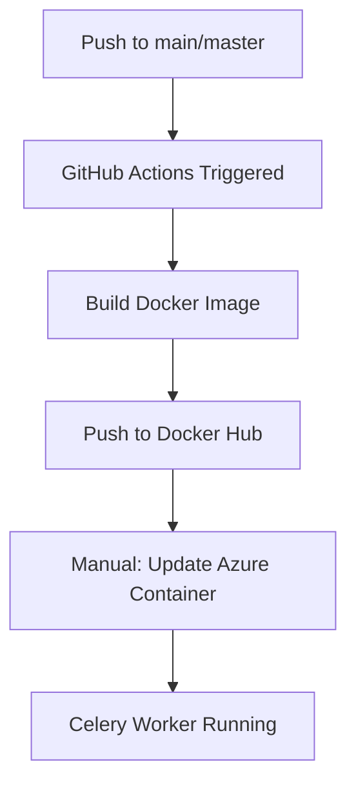

# Docker Hub Deployment Setup

This guide explains how to set up automated deployment of the Celery worker to Docker Hub and Azure Container Instances.

## Overview

The workflow automatically:
1. Builds the Celery worker Docker image on every push to `main`/`master`
2. Pushes the image to Docker Hub repository: `umemployed/um_celery_worker`
3. Tags the image with both `latest` and the commit SHA
4. Provides deployment instructions for Azure Container Instances

## Prerequisites

### 1. Docker Hub Repository
Create a Docker Hub repository:
1. Go to [Docker Hub](https://hub.docker.com/)
2. Sign in or create an account
3. Click "Create Repository"
4. Repository name: `um_celery_worker`
5. Namespace: `umemployed` (your Docker Hub username)
6. Set visibility to Private or Public as needed

### 2. Docker Hub Access Token
Create a personal access token:
1. Go to Docker Hub → Account Settings → Security
2. Click "New Access Token"
3. Name: `GitHub Actions Umemployed`
4. Permissions: Read, Write, Delete
5. Copy the generated token (you won't see it again!)

## GitHub Secrets Setup

Add these secrets to your GitHub repository:

1. Go to your GitHub repo → Settings → Secrets and variables → Actions
2. Click "New repository secret" for each:

| Secret Name | Value | Description |
|-------------|-------|-------------|
| `DOCKER_HUB_CELERY_USERNAME` | `umemployed` | Your Docker Hub username |
| `DOCKER_HUB_CELERY_TOKEN` | `dckr_pat_xxxxx...` | The access token from Docker Hub |

## Workflow Triggers

The workflow runs automatically when you push changes to:
- `resume/tasks.py`
- `resume/models.py` 
- `job/tasks.py`
- `users/tasks.py`
- `messaging/tasks.py`
- `Dockerfile.celery`
- `requirements.txt`
- `umemployed/celery.py`
- `umemployed/settings.py`

You can also trigger it manually:
1. Go to GitHub → Actions tab
2. Select "Build and Deploy Celery Worker to Docker Hub"
3. Click "Run workflow"

## Azure Container Instances Deployment

### Option 1: Azure CLI (Recommended)

```bash
# Update existing container with new image
az container update \
  --resource-group <your-resource-group> \
  --name <celery-container-name> \
  --image umemployed/um_celery_worker:latest

# Or restart the container to pull latest image
az container restart \
  --resource-group <your-resource-group> \
  --name <celery-container-name>
```

### Option 2: Create New Container Instance

```bash
az container create \
  --resource-group <your-resource-group> \
  --name umemployed-celery-worker \
  --image umemployed/um_celery_worker:latest \
  --cpu 1 \
  --memory 1.5 \
  --restart-policy Always \
  --environment-variables \
    REDIS_URL=<your-redis-url> \
    DATABASE_URL=<your-database-url> \
    DJANGO_SETTINGS_MODULE=umemployed.settings \
  --secure-environment-variables \
    SECRET_KEY=<your-secret-key> \
    OPENAI_API_KEY=<your-openai-key>
```

### Option 3: Azure Portal

1. Go to Azure Portal → Container Instances
2. Find your existing Celery worker container
3. Stop the container
4. Delete the container
5. Create new container:
   - Image: `umemployed/um_celery_worker:latest`
   - Configure the same environment variables
   - Set restart policy to "Always"

## Environment Variables for Azure Container

Make sure your Azure Container Instance has these environment variables:

### Required
- `REDIS_URL` - Your Redis connection string
- `DATABASE_URL` - Your PostgreSQL connection string  
- `SECRET_KEY` - Django secret key
- `DJANGO_SETTINGS_MODULE=umemployed.settings`

### Optional (but recommended)
- `OPENAI_API_KEY` - For resume enhancement features
- `REDIS_SSL_CERT_REQS=none` - For Azure Redis SSL
- `DEBUG=False` - Production setting

## Monitoring and Troubleshooting

### Check Container Logs
```bash
az container logs \
  --resource-group <your-resource-group> \
  --name <celery-container-name>
```

### Check Container Status
```bash
az container show \
  --resource-group <your-resource-group> \
  --name <celery-container-name> \
  --query "{Status:instanceView.state,RestartCount:instanceView.restartCount,Image:containers[0].image}"
```

### Verify Celery is Running
The container logs should show:
```
Running migrations...
Collecting static files...
Running custom command: celery -A umemployed worker --loglevel=info
[2024-XX-XX XX:XX:XX,XXX: INFO/MainProcess] Connected to redis://...
[2024-XX-XX XX:XX:XX,XXX: INFO/MainProcess] mingle: searching for neighbors
[2024-XX-XX XX:XX:XX,XXX: INFO/MainProcess] mingle: all alone
[2024-XX-XX XX:XX:XX,XXX: INFO/MainProcess] celery@hostname ready.
```

## Testing the Deployment

1. **Check if the image was built**: Go to [Docker Hub](https://hub.docker.com/r/umemployed/um_celery_worker/tags) to see if the latest tag was pushed

2. **Test a Celery task**: Use your Django app to trigger a resume enhancement task and check if it's processed

3. **Monitor logs**: Check both your Django app logs and the Celery worker logs in Azure

## Automated Deployment Flow



## Next Steps

1. Set up the GitHub secrets as described above
2. Push a change to trigger the workflow
3. Update your Azure Container Instance to use the new image
4. Test the async resume enhancement functionality

## Troubleshooting Common Issues

### Workflow Fails
- Check if GitHub secrets are set correctly
- Verify Docker Hub repository exists and is accessible
- Check workflow logs in GitHub Actions tab

### Container Won't Start
- Verify environment variables are set correctly
- Check if Redis and database are accessible from Azure
- Review container logs for specific error messages

### Tasks Not Processing
- Ensure Redis connection is working
- Check if Celery worker is discovering your tasks
- Verify task imports in `umemployed/celery.py`
